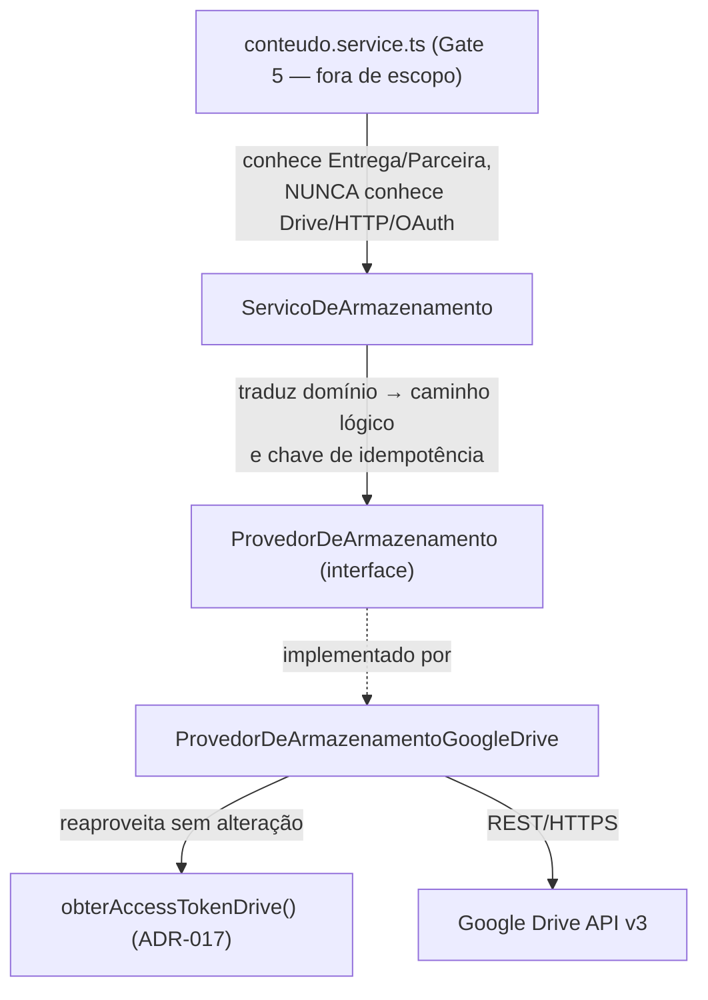
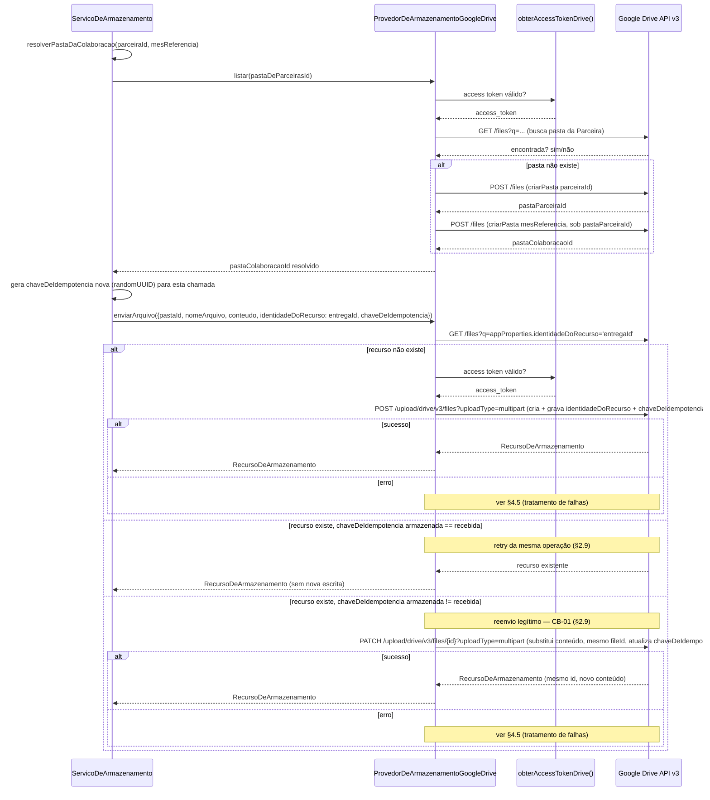
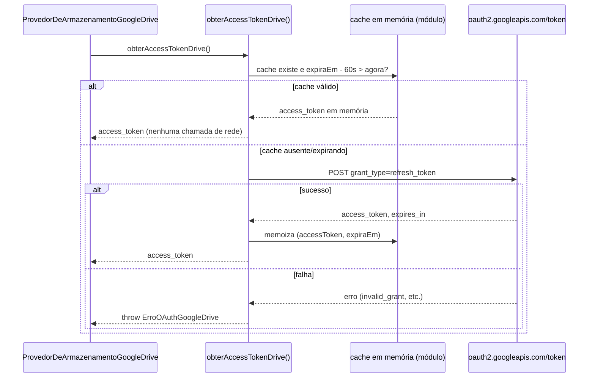
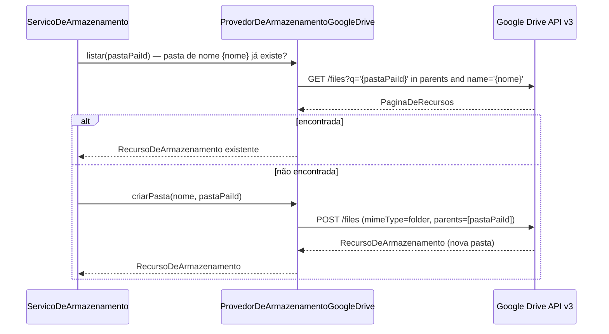
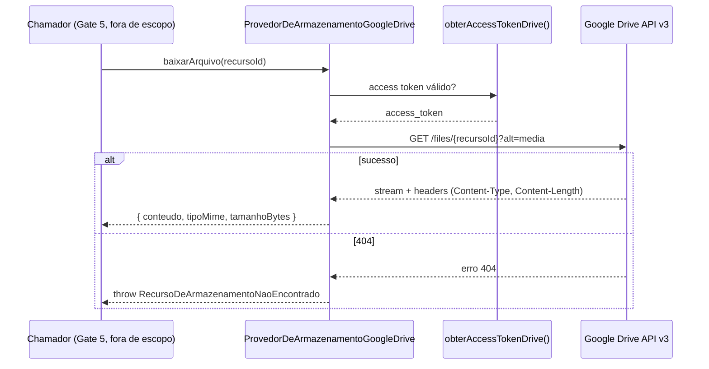
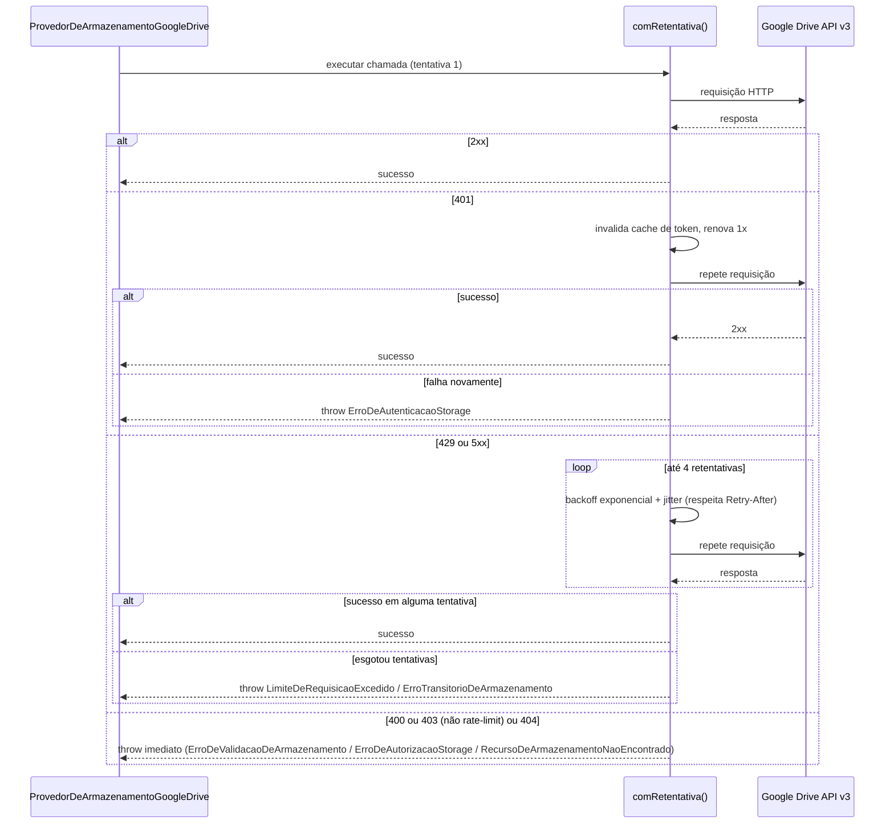

# Technical Design Document — Storage (Google Drive), Fase 4

> **Status:** Proposta — Gate 2 da Fase 4, aguardando aprovação do responsável do projeto.
> Nenhum código de produção, endpoint, tela, regra de negócio ou migration foi criado a
> partir deste documento. Este é o **documento único de referência para o Gate 3**
> (implementação da infraestrutura) — `PORTAL_ARQUITETURA.md` §6 mantém só um resumo e aponta
> para cá, para não duplicar conteúdo.
>
> **Decisão de escopo já aceita (Gate 1):** `ADR-019` (`knowledge/ARCHITECTURAL_DECISIONS.md`)
> — escopo OAuth `drive.file`, não `drive` completo. Este TDD projeta a arquitetura *sobre*
> essa decisão já tomada; não a reabre.
>
> **Revisão de aprovação (2026-07-30):** a primeira versão deste TDD usava `entregaId` como
> chave de idempotência permanente em `enviarArquivo`, o que bloquearia silenciosamente
> reenvio legítimo de material — em conflito direto com `SPEC-012` §16, CB-01 ("Upload
> repetido para a mesma Entrega → substitui o material; mantém identidade", aprovado pelo PO
> em 2026-07-15). §2.2, §2.4, §2.9, §3.4, §4.1, §6.1-§6.3, §7.1, §7.3 e §8 foram revisados
> para separar **idempotência técnica de operação** (protege só contra retry de rede da
> mesma tentativa de upload) de **identidade do recurso** (`entregaId`, usada para decidir
> substituição). Decisão tomada pelo responsável do projeto antes da aprovação do Gate 2.

---

## 1. Visão geral

### 1.1 Objetivo da camada

Fornecer ao Portal DODÔ uma camada de armazenamento de arquivo (upload/download/organização
de material enviado pela Parceira) que hoje não existe de fato — `material.storage.ts`
grava em disco local como placeholder deliberado (comentário no próprio arquivo). Este TDD
projeta a substituição desse placeholder por uma implementação real sobre Google Drive,
mantendo a mesma disciplina de isolamento por interface já usada hoje.

### 1.2 Responsabilidades

- Criar e resolver a estrutura lógica de pastas do Drive (§3).
- Enviar, baixar, renomear, remover e listar arquivo/pasta via Google Drive API v3.
- Renovar automaticamente o access token OAuth, sem intervenção manual no caminho normal.
- Garantir idempotência de upload (retry de rede não deve duplicar arquivo).
- Traduzir erro de infraestrutura (HTTP/Google) em erro de domínio próprio, nunca vazando
  detalhe de credencial ou de implementação para camadas acima.

### 1.3 Limites (o que esta camada explicitamente NÃO faz)

- Não decide **quando** um upload deve acontecer, nem qual estado a Entrega deve assumir
  depois — isso é do Gate 5 (`conteudo.service.ts`), que ainda não existe integrado a esta
  camada.
- Não expõe rota HTTP nem qualquer superfície pública além dos módulos TypeScript internos
  (`shared/storage/`) — nenhum endpoint é criado por este TDD nem pelo Gate 3.
- Não persiste nada em Postgres — nenhuma migration, nenhuma tabela nova. Todo estado de
  idempotência vive no próprio Drive (§2.9), não em banco.
- Não decide política de retenção/backup do Drive — fora de escopo desta fase.

### 1.4 Integrações

| Sistema | Direção | Protocolo | Observação |
|---|---|---|---|
| Google Drive API v3 | Portal → Drive | REST/HTTPS, `fetch` nativo | Único provedor concreto desta fase |
| Google OAuth 2.0 Token Endpoint | Portal → Google | REST/HTTPS | Já implementado (`googleDriveClient.ts`, ADR-017), reaproveitado sem alteração |

### 1.5 Dependências

- **De infraestrutura já existente, reaproveitada sem alteração:** `obterAccessTokenDrive()`
  (`portal-backend/src/shared/googleDrive/googleDriveClient.ts`), `env.googleDrive.*`
  (`portal-backend/src/config/env.ts`).
- **De runtime:** Node.js 22+ (`fetch` nativo já em uso no projeto).
- **De pacote novo:** nenhuma. Decisão explícita (§2.4) de não adicionar `googleapis`/
  `google-auth-library`.
- **De decisão upstream:** `ADR-017` + `ADR-019` (escopo `drive.file`) — este TDD é
  consequência direta delas, não as reabre.

---

## 2. Arquitetura

### 2.1 Visão em camadas



Três camadas, isolamento estrito:

1. **`ServicoDeArmazenamento`** — única camada que conhece vocabulário de domínio
   (`parceiraId`, `mesReferencia`, `entregaId`, `formato`). Resolve/provisiona pasta,
   deriva chave de idempotência, traduz erro de infraestrutura em erro de domínio.
2. **`ProvedorDeArmazenamento`** (interface) — contrato puro de infraestrutura: pasta e
   arquivo, nada além disso. Não sabe o que é uma Entrega.
3. **`ProvedorDeArmazenamentoGoogleDrive`** — implementação concreta da interface acima,
   REST da Drive API v3.

**Por que separar 2 e 3 do que hoje é uma coisa só (`ArmazenamentoDeMaterial`):** a
assinatura atual (`salvar(entregaId, arquivo)`) já mistura infraestrutura com domínio — a
interface de armazenamento "sabe" o que é uma Entrega. Esta separação é o que permite trocar
Google Drive por outro provedor no futuro (`PORTAL_ARQUITETURA.md` §6.1, `[PROPOSTA]`) sem
tocar em nenhuma regra de negócio de Conteúdo/Entrega, e é o que faz `ServicoDeArmazenamento`
ser testável com um provedor fake em memória, sem rede (§6).

Nomenclatura em português, mesma convenção do código já existente
(`ArmazenamentoDeMaterial`/`ArmazenamentoLocalEmDisco`, `ErroOAuthGoogleDrive`). Mapeamento
dos termos em inglês usados neste briefing: **StorageProvider → `ProvedorDeArmazenamento`**;
**GoogleDriveStorageProvider → `ProvedorDeArmazenamentoGoogleDrive`**.

### 2.2 Interfaces públicas, models e tipos

```typescript
// portal-backend/src/shared/storage/tipos.ts

export interface RecursoDeArmazenamento {
  /** ID do recurso no provedor (fileId/folderId do Drive). Opaco para quem chama. */
  id: string;
  nome: string;
  tipo: "arquivo" | "pasta";
  /** Só para log/depuração — nunca usado para localizar o recurso de novo. */
  caminhoLogico: string;
  tamanhoBytes?: number;
  tipoMime?: string;
  criadoEm: string;    // ISO 8601
  atualizadoEm: string;
}

export interface PaginaDeRecursos {
  itens: RecursoDeArmazenamento[];
  proximoToken?: string;
}

export interface ParametrosDeEnvio {
  pastaId: string;
  nomeArquivo: string;
  conteudo: Buffer;
  tipoMime: string;
  /**
   * Identidade lógica do recurso (hoje, sempre `entregaId`) — decide CRIAR (primeira vez)
   * vs. SUBSTITUIR (já existe recurso com esta identidade). Estável entre chamadas
   * distintas de `enviarMaterialDaEntrega` para a mesma Entrega. Ver §2.9.
   */
  identidadeDoRecurso: string;
  /**
   * Identifica uma tentativa lógica de upload (uma "operação"), não a Entrega. Gerado uma
   * vez por chamada a `enviarMaterialDaEntrega` e reaproveitado apenas pelas retentativas de
   * rede de `comRetentativa()` dentro dessa mesma chamada — nunca entre chamadas distintas.
   * Protege só contra duplicação por retry de rede da mesma operação; NÃO impede reenvio
   * legítimo (CB-01, `SPEC-012` §16) — reenvio é sempre uma operação nova, com uma nova
   * chaveDeIdempotencia. Ver §2.9.
   */
  chaveDeIdempotencia: string;
}
```

```typescript
// portal-backend/src/shared/storage/provedorDeArmazenamento.ts

export interface ProvedorDeArmazenamento {
  criarPasta(nome: string, pastaPaiId: string | null): Promise<RecursoDeArmazenamento>;
  enviarArquivo(params: ParametrosDeEnvio): Promise<RecursoDeArmazenamento>;
  baixarArquivo(recursoId: string): Promise<{
    conteudo: NodeJS.ReadableStream;
    tipoMime: string;
    tamanhoBytes: number;
  }>;
  renomear(recursoId: string, novoNome: string): Promise<RecursoDeArmazenamento>;
  remover(recursoId: string): Promise<void>;
  listar(pastaId: string, tamanhoPagina?: number, tokenPagina?: string): Promise<PaginaDeRecursos>;
  obterMetadados(recursoId: string): Promise<RecursoDeArmazenamento>;
}
```

```typescript
// portal-backend/src/shared/storage/servicoDeArmazenamento.ts

export interface ServicoDeArmazenamento {
  /** Resolve, provisionando se necessário, a pasta Parceira × MesReferencia (§3). */
  resolverPastaDaColaboracao(parceiraId: string, mesReferencia: string): Promise<RecursoDeArmazenamento>;

  enviarMaterialDaEntrega(params: {
    entregaId: string;
    parceiraId: string;
    mesReferencia: string;
    formato: string;
    nomeOriginal: string;
    conteudo: Buffer;
    tipoMime: string;
  }): Promise<RecursoDeArmazenamento>;
}
```

### 2.3 Serviços — responsabilidade de cada um

| Serviço/módulo | Responsabilidade | Conhece domínio? | Conhece Drive? |
|---|---|---|---|
| `ServicoDeArmazenamento` | Orquestra provisionamento de pasta + envio, gera `chaveDeIdempotencia` nova por chamada e passa `identidadeDoRecurso` (`entregaId`), traduz erro | Sim | Não (só a interface `ProvedorDeArmazenamento`) |
| `ProvedorDeArmazenamentoGoogleDrive` | Implementa cada operação como chamada REST à Drive API v3 | Não | Sim |
| `obterAccessTokenDrive()` (já existe) | Troca/memoiza access token | Não | Sim (só OAuth) |

### 2.4 `ProvedorDeArmazenamentoGoogleDrive` — decisão de implementação

**Decisão:** `fetch` nativo, sem `googleapis`/`google-auth-library` — estende a mesma
decisão já registrada em `ADR-017` para a validação de OAuth, agora reavaliada no momento
correto (quando a Storage real está sendo desenhada, como o próprio ADR previa).

**Justificativa:** os 6 endpoints necessários são REST simples; a tipagem própria do SDK do
Google tende a divergir do padrão de tipos em português já usado no projeto. Trade-off
aceito: escrever manualmente os poucos tipos de resposta necessários, mesmo padrão de
`RespostaTokenGoogle` em `googleDriveClient.ts`.

**Mapeamento de operação → endpoint:**

| Método da interface | Endpoint Drive API v3 | Observação |
|---|---|---|
| `criarPasta` | `POST /files` (`mimeType: application/vnd.google-apps.folder`) | `parents: [pastaPaiId]`; `pastaPaiId=null` cria sob a raiz visível ao OAuth Client |
| `enviarArquivo` — recurso novo | `POST /upload/drive/v3/files?uploadType=multipart` | Metadata (nome, parents, `appProperties.identidadeDoRecurso`, `appProperties.chaveDeIdempotencia`) + mídia no mesmo request |
| `enviarArquivo` — substituição (CB-01) | `PATCH /upload/drive/v3/files/{id}?uploadType=multipart` | Mesmo `fileId` ("mantém identidade"); metadata (`appProperties.chaveDeIdempotencia` atualizada) + novo conteúdo no mesmo request. Ver §2.9 |
| `baixarArquivo` | `GET /files/{id}?alt=media` | Stream; `tipoMime`/`tamanhoBytes` lidos dos headers |
| `renomear` | `PATCH /files/{id}` (`name`) | Metadata-only |
| `remover` | `PATCH /files/{id}` (`trashed: true`) | Ver §5.5 — reversível, não `DELETE` definitivo |
| `listar` | `GET /files?q='{pastaId}' in parents&pageSize=&pageToken=` | Paginação nativa (`nextPageToken`) |
| `obterMetadados` | `GET /files/{id}?fields=...` | Usado pela verificação de idempotência (§2.9) |

### 2.5 Fluxo OAuth

**Já implementado (ADR-017), reaproveitado sem alteração.** Ver §4.2 para o diagrama de
sequência. Nenhuma mudança proposta a `googleDriveClient.ts`.

### 2.6 Persistência de credenciais

- `GOOGLE_DRIVE_CLIENT_ID`/`GOOGLE_DRIVE_CLIENT_SECRET`/`GOOGLE_DRIVE_REFRESH_TOKEN`:
  variável de ambiente (`.env`, nunca commitado), mesmo padrão de segredo de infraestrutura
  já usado no projeto — **nenhuma mudança proposta aqui**.
- **Nenhuma credencial em Postgres.** Nenhuma migration, nenhuma tabela nova — restrição
  explícita deste Gate.
- `access_token` de curta duração: só em memória de processo (`cache` em
  `googleDriveClient.ts`), nunca persistido em disco/banco/log.

### 2.7 Renovação automática

Ver `googleDriveClient.ts` (§4.2 para o fluxo completo): memoização em variável de módulo,
renovação automática 60s antes da expiração real informada pelo Google
(`expires_in`). **Limitação aceita:** cache por processo, não compartilhado entre instâncias
— redundância pequena se o backend escalar horizontalmente; sem custo de quota relevante;
reavaliar só se/quando isso vier a ser necessário.

### 2.8 Retry

Backoff exponencial com jitter, função utilitária `comRetentativa<T>(fn, opcoes)` usada por
todo método de `ProvedorDeArmazenamentoGoogleDrive` que faz chamada de rede.

| Parâmetro | Valor |
|---|---|
| Tentativas máximas | 5 (1 original + 4 retentativas) |
| Atraso base | 250ms, dobrando a cada tentativa |
| Teto de atraso | 8s |
| Jitter | ±20% aleatório |
| Respeita `Retry-After`? | Sim, se presente e maior que o backoff calculado |

- **Retryable:** `429` (`rateLimitExceeded`/`userRateLimitExceeded`), `500`/`502`/`503`/
  `504`, erro de rede/timeout do `fetch`.
- **Não retryable:** `400` (bug, não instabilidade), `403` que não seja rate limit
  (`insufficientPermissions`), `404`.
- **`401` (caso especial):** não é backoff — invalida o cache de
  `obterAccessTokenDrive()`, tenta renovar 1x, se persistir trata como não retryable.

### 2.9 Idempotência

**Dois problemas distintos, resolvidos com duas chaves distintas** (revisão de aprovação,
2026-07-30 — ver nota no topo do documento):

1. **Idempotência técnica de operação.** Conexão pode cair depois que o Drive já processou o
   request, mas antes da resposta chegar — `files.create`/`files.update` não são
   nativamente idempotentes na API do Google. Um retry ingênuo *da mesma tentativa* não pode
   duplicar/reprocessar o efeito.
2. **Identidade do recurso e substituição (CB-01, `SPEC-012` §16).** "Upload repetido para a
   mesma Entrega" — aprovado pelo PO em 2026-07-15 — **substitui o material; mantém
   identidade**. Isto é uma operação nova e legítima, não um retry, e não pode ser bloqueada
   pela idempotência técnica. A primeira versão deste TDD usava `entregaId` como chave única
   de idempotência permanente, o que confundia os dois problemas e bloquearia
   silenciosamente todo reenvio — corrigido aqui.

**Decisão:** usar `appProperties` do próprio Drive (metadado chave-valor nativo, até 30
entradas por arquivo, visível/gravável só pelo app que criou o recurso — compatível com
`drive.file`) para guardar **as duas chaves separadamente**, em vez de tabela própria no
Postgres:

- `appProperties.identidadeDoRecurso` — estável, hoje sempre `entregaId`. Decide **qual**
  recurso do Drive corresponde a esta Entrega.
- `appProperties.chaveDeIdempotencia` — muda a cada operação nova. Decide se a chamada atual
  é **um retry da última operação** (mesmo valor) ou **uma operação nova** (valor diferente).

**Origem da `chaveDeIdempotencia`:** gerada por `ServicoDeArmazenamento` (`randomUUID()`) uma
vez por chamada a `enviarMaterialDaEntrega`, e reaproveitada só pelas retentativas de
`comRetentativa()` **dentro dessa mesma chamada**. Uma nova chamada a
`enviarMaterialDaEntrega` para a mesma Entrega — reenvio do Portal, por exemplo — gera uma
`chaveDeIdempotencia` nova, e é por definição uma operação nova.

**Fluxo em `enviarArquivo`:**
1. Antes de escrever, consulta `files.list` filtrando por `appProperties has
   {key:'identidadeDoRecurso', value:'<entregaId>'}` dentro da pasta alvo — busca **por
   identidade do recurso**, não mais por chave de idempotência.
2. **Não encontrado** → cria (`POST .../files?uploadType=multipart`), gravando
   `appProperties.identidadeDoRecurso` e `appProperties.chaveDeIdempotencia` já no mesmo
   request (evita janela onde o arquivo existe sem as chaves).
3. **Encontrado, com `chaveDeIdempotencia` armazenada igual à recebida agora** → retry da
   mesma operação (ex.: `comRetentativa()` reenviando após timeout) → retorna o recurso
   existente **sem nova chamada de escrita**.
4. **Encontrado, com `chaveDeIdempotencia` armazenada diferente da recebida agora** →
   operação nova sobre uma Entrega que já tem material (CB-01) → **substitui o conteúdo do
   arquivo existente**, mantendo o mesmo `fileId` ("mantém identidade" — CB-01):
   `PATCH .../files/{id}?uploadType=multipart` com o novo conteúdo e
   `appProperties.chaveDeIdempotencia` atualizada, no mesmo request.

**Alternativa descartada:** tabela `storage_operacoes` no Postgres — rejeitada por adicionar
escopo de schema fora deste Gate, quando o Drive já resolve o mesmo problema nativamente.

**Nota de limitação aceita:** o Drive mantém revisões automáticas de conteúdo por padrão
(retenção própria, tipicamente ~30 dias, não configurada nem controlada por este TDD) — isso
não é um histórico de versões de produto, é comportamento nativo do Drive fora do controle
da aplicação. Se histórico de versões vier a ser um requisito de produto, é decisão nova,
fora deste Gate (ver §7.3).

### 2.10 Tratamento de erros

Hierarquia própria, mesmo padrão de `ErroOAuthGoogleDrive` (classe estendendo `Error`, dado
bruto do provedor preservado só para log):

```typescript
// portal-backend/src/shared/storage/erros.ts

export abstract class ErroDeArmazenamento extends Error {
  constructor(message: string, public readonly causaOriginal?: unknown) {
    super(message);
  }
}

export class ErroDeAutenticacaoStorage extends ErroDeArmazenamento {}    // 401 persistente
export class ErroDeAutorizacaoStorage extends ErroDeArmazenamento {}     // 403 não-rate-limit
export class RecursoDeArmazenamentoNaoEncontrado extends ErroDeArmazenamento {} // 404
export class LimiteDeRequisicaoExcedido extends ErroDeArmazenamento {}   // 429 após esgotar retries
export class ErroTransitorioDeArmazenamento extends ErroDeArmazenamento {} // 5xx/rede após esgotar retries
export class ErroDeValidacaoDeArmazenamento extends ErroDeArmazenamento {} // 400, tipo/tamanho inválido
```

`ServicoDeArmazenamento` nunca deixa um erro cru de `ProvedorDeArmazenamento` vazar sem
tradução — mesmo princípio já registrado em `PORTAL_ARQUITETURA.md` §2 ("nunca expor PII em
log") aplicado a mensagem de erro: erro do Google pode conter detalhe de configuração
interna que não deve chegar a uma camada de apresentação futura.

### 2.11 Estratégia de logs

Log estruturado, um evento por operação, correlacionado por `chaveDeIdempotencia` e
`recursoId`. Campos: `operacao`, `pastaId`/`recursoId`, `tamanhoBytes`, `duracaoMs`,
`resultado` (`sucesso`/`erro`/`retentativa`), `tentativaNumero`, `codigoErroGoogle`.

**Nunca logado:** `access_token`, `refresh_token`, conteúdo binário, nome original do
arquivo em texto puro (pode conter dado pessoal — logar só `recursoId`/`formato`/
`entregaId`).

**Mecanismo:** `console.*` com prefixo de contexto, mesmo padrão já usado em
`shared/cep/resolver.ts` (`[CepResolver] ...`) — proposta: `[ProvedorDeArmazenamentoGoogleDrive]`/
`[ServicoDeArmazenamento]`. Nenhuma biblioteca de log nova — o projeto não usa `pino`/
`winston` hoje, e nenhuma outra parte do backend justifica introduzir uma agora só para
Storage.

### 2.12 Estratégia de observabilidade

**Estado atual do projeto:** nenhuma infraestrutura de métricas/tracing existe em
`portal-backend` (sem Prometheus, sem OpenTelemetry, sem APM). **Proposta desta fase:**
manter-se dentro dessa realidade — observabilidade via log estruturado (§2.11) é suficiente
para os requisitos desta fase (nenhum SLA de disponibilidade documentado, volume de upload
inicial baixo). Métricas agregadas (taxa de erro, p95 de latência por operação) ficam
**declaradas como gap, não implementadas** — se se tornarem necessárias, é decisão de
infraestrutura própria, fora do escopo deste TDD (ADR-003: não inventar requisito não
documentado).

### 2.13 Injeção de dependência

Sem framework de DI — o projeto não usa um hoje (`material.storage.ts` exporta instância
singleton diretamente). Mantém o padrão, com seleção por config:

```typescript
// portal-backend/src/shared/storage/index.ts

export function criarProvedorDeArmazenamento(config: ConfiguracaoDeArmazenamento): ProvedorDeArmazenamento {
  switch (config.tipo) {
    case "google-drive":
      return new ProvedorDeArmazenamentoGoogleDrive(config.googleDrive);
    default:
      throw new Error(`Provedor de armazenamento não suportado: ${config.tipo}`);
  }
}

export const servicoDeArmazenamento: ServicoDeArmazenamento =
  new ServicoDeArmazenamentoImpl(criarProvedorDeArmazenamento(env.storage));
```

Testes injetam um `ProvedorDeArmazenamento` fake diretamente no construtor de
`ServicoDeArmazenamentoImpl` — sem mock de rede, mesmo padrão de isolamento que
`ArmazenamentoDeMaterial` já permite hoje em `material.storage.test.ts`.

---

## 3. Estrutura lógica do Google Drive

### 3.1 Gap de vocabulário — declarado, não presumido

O pedido original deste Gate 2 pede organização "por cliente" e "por campanha". **Nenhum
dos dois conceitos existe no domínio atual do Portal:**

- **"Cliente"** não existe como ator — `ADR-008` (`knowledge/ARCHITECTURAL_DECISIONS.md`)
  decide explicitamente que o sistema é **single-tenant**, sem o ator `Marca`/tenant/cliente
  externo no MVP.
- **"Campanha"** é vocabulário do Sistema B (Laravel, removido), explicitamente banido do
  código novo por `ADR-006` — o termo equivalente no vocabulário oficial (Contrato Soberano)
  é **Colaboração Mensal** (`Parceira × MesReferencia`).

Por `ADR-003` (não inventar requisito onde a documentação for omissa), este TDD **não**
projeta estrutura por cliente/campanha. Em vez disso, organiza pela unidade real do domínio
que já existe hoje: **Parceira** e **Colaboração Mensal**.

### 3.2 Organização de pastas

```
<raiz do Portal, criada pela própria app na primeira execução>
└── Parceiras/
    └── {parceiraId}/              (UUID — organização "por Parceira")
        └── {mesReferencia}/       (formato "YYYY-MM" — organização "por Colaboração
                                     Mensal", equivalente funcional de "por campanha")
            └── {formato}-{entregaId}.{extensaoOriginal}
```

Árvore de 2 níveis (Parceira → MesReferencia), não 3 (sem subpasta por `formato`) —
mantém navegação manual simples no Drive, e o nome do arquivo já carrega o `formato`
(Reel/Carrossel/etc.) sem precisar de mais uma pasta.

**Justificativa da profundidade:** cada nível a mais é uma chamada de API extra em
`resolverPastaDaColaboracao` (verificar existência antes de criar) — 2 níveis é o mínimo
necessário para refletir a hierarquia real do domínio (`Parceira` contém N
`ColaboracaoMensal`, cada uma com N `Entrega`) sem introduzir uma dimensão que o domínio não
tem hoje (`formato` já é legível no nome do arquivo).

### 3.3 Pasta raiz

Consequência direta de `drive.file` (`ADR-019`): a pasta raiz **precisa ser criada pela
própria aplicação** — nenhuma pasta pré-existente pode ser reaproveitada, porque `drive.file`
só concede acesso a recurso criado (ou aberto via Picker, fora de escopo) sob esta
autorização. ID persistido como config (`GOOGLE_DRIVE_ROOT_FOLDER_ID`), criado manualmente
uma única vez via script análogo a `testarOAuthGoogleDrive.ts` — não em tempo de request.

### 3.4 Convenções de nomenclatura

| Elemento | Convenção | Justificativa |
|---|---|---|
| Pasta de Parceira | `{parceiraId}` (UUID), nunca nome comercial | Evita expor PII a quem tiver acesso de leitura ao Drive; evita colisão por nome digitado diferente |
| Pasta de Colaboração Mensal | `{mesReferencia}` (`YYYY-MM`) | Mesmo formato já usado em `Entrega`/`ColaboracaoMensal` — nenhuma tradução entre camadas |
| Arquivo de material | `{formato}-{entregaId}.{ext}` | Único por Entrega (que tem no máximo um material); legível para auditoria manual; não usa o nome original enviado pela Parceira (pode ter caractere inválido ou PII) |
| Metadado de nome original | `appProperties.nomeOriginal` | Preserva o nome que a Parceira enviou sem usá-lo como nome físico do arquivo |
| Metadado de identidade do recurso | `appProperties.identidadeDoRecurso` (`entregaId`) | Decide CRIAR vs. SUBSTITUIR — ver §2.9 |
| Metadado de operação | `appProperties.chaveDeIdempotencia` | Distingue retry de rede (mesmo valor) de reenvio legítimo (valor novo) — ver §2.9 |

### 3.5 Arquivos temporários vs. permanentes

**Não documentado como requisito desta fase.** Nenhuma SPEC ou seção de
`PORTAL_ARQUITETURA.md` define um conceito de arquivo temporário para o Portal atual (o
Shared Drive `Temporarios/` citado no ADR-017 legado pertence ao Sistema B — `ADR-019` já
declara essa estrutura não vinculante). **Proposta mínima, se algum dia necessário:**
upload direto na pasta final (§3.2) já é atômico do ponto de vista do domínio — a Entrega só
transiciona de estado após confirmação de gravação (`PORTAL_ARQUITETURA.md` §5) — portanto
não há, hoje, um cenário real que exija uma área de rascunho/temporário separada. Declarado
como gap, não implementado.

---

## 4. Fluxos

### 4.1 Upload de material (fluxo completo, incluindo provisionamento e idempotência)



### 4.2 Renovação de token



### 4.3 Criação de pasta (provisionamento sob demanda)



### 4.4 Recuperação (download) de arquivo



### 4.5 Tratamento de falhas (retry + erro terminal)



---

## 5. Segurança

### 5.1 Escopos OAuth

**`https://www.googleapis.com/auth/drive.file`**, único escopo — decisão já aceita
(`ADR-017`/`ADR-019`, Gate 1). Não sensível, não exige verificação do Google. Concede acesso
só a recurso criado pelo próprio OAuth Client — nenhum acesso a arquivo pré-existente na
conta (§3.3).

### 5.2 Armazenamento de tokens

| Token | Onde fica | Duração | Nunca vai para |
|---|---|---|---|
| `refresh_token` | Variável de ambiente (`.env`, não commitado) | Longa duração, revogável manualmente | Postgres, log, frontend, resposta HTTP |
| `access_token` | Memória de processo (`cache` em `googleDriveClient.ts`) | ~1h (`expires_in` do Google), renovado automaticamente | Disco, Postgres, log, frontend |

### 5.3 Política de menor privilégio

- Escopo único, mínimo necessário (`drive.file`), reafirmado por este TDD.
- Nenhuma credencial de armazenamento é exposta ao frontend — todo acesso ao Drive é
  mediado pelo backend; nenhuma URL assinada direta ao Drive é gerada por esta fase (não
  necessário, pois não há upload/download direto do cliente nesta fase — ver §1.3).
- `ProvedorDeArmazenamento` (interface) não expõe nenhum método que permita acesso fora da
  pasta raiz do Portal — todo caminho é relativo a `GOOGLE_DRIVE_ROOT_FOLDER_ID`.

### 5.4 Tratamento de credenciais

- Nenhuma mudança ao padrão já em produção (`env.googleDrive.*`, `.env.example` documentado
  sem valor real).
- Erros de autenticação (§2.10) nunca incluem `client_secret`/`refresh_token`/`access_token`
  na mensagem exposta — só no log estruturado interno (§2.11), e mesmo aí nunca o valor do
  token em si, só o código de erro do Google.

### 5.5 Riscos conhecidos

- **Remoção não é soft-delete de aplicação.** `remover` usa `trashed: true` (lixeira do
  Drive, reversível por padrão ~30 dias), não `DELETE` definitivo — mitigação deliberada,
  mas ainda depende da política de retenção da lixeira do Drive, não de uma tabela de
  auditoria própria.
- **Conta única administrada.** Se o `refresh_token` for revogado (troca de senha da conta,
  suspensão, 6 meses sem uso), não há fluxo automático de re-consentimento — mesma limitação
  já documentada em `ADR-017`, reafirmada aqui porque a Storage real passa a depender disso
  em produção (a validação anterior era só um script manual).
- **`appProperties` como mecanismo de idempotência é específico do Drive.** Se um provedor
  futuro (S3, por exemplo) não tiver equivalente nativo, a estratégia de idempotência
  precisa ser reprojetada nesse momento (§2.9).

---

## 6. Estratégia de testes

### 6.1 Testes unitários — `ProvedorDeArmazenamentoGoogleDrive`

`fetch` injetado como dependência explícita (mesmo comportamento em produção; `googleDriveClient.ts`
já usa o `fetch` global — proposta é torná-lo injetável só para teste). Casos mínimos:

- Sucesso de cada operação (`criarPasta`, `enviarArquivo`, `baixarArquivo`, `renomear`,
  `remover`, `listar`, `obterMetadados`).
- `enviarArquivo` para `identidadeDoRecurso` nova → cria (`POST .../files?uploadType=multipart`),
  grava `appProperties.identidadeDoRecurso` e `appProperties.chaveDeIdempotencia`.
- `enviarArquivo` repetido com a **mesma** `chaveDeIdempotencia` para a mesma
  `identidadeDoRecurso` (retry) → **não** gera novo `files.create`/`files.update`, retorna o
  recurso já existente sem chamada de escrita adicional (CT — idempotência de operação).
- `enviarArquivo` com `chaveDeIdempotencia` **diferente** para a mesma `identidadeDoRecurso`
  já existente (reenvio, CB-01) → **substitui**: chama `PATCH .../files/{id}?uploadType=multipart`,
  mantém o mesmo `fileId` no `RecursoDeArmazenamento` retornado, atualiza
  `appProperties.chaveDeIdempotencia` (CT — CB-01, não pode ser confundido com retry).
- `listar` com paginação → `proximoToken` propagado corretamente entre chamadas.

### 6.2 Testes unitários — `ServicoDeArmazenamento`

`ProvedorDeArmazenamento` fake em memória (sem rede). Casos mínimos:

- Provisionamento de pasta só na primeira chamada por `Parceira × MesReferencia`; reuso em
  chamadas seguintes (sem nova `criarPasta`).
- Duas chamadas distintas a `enviarMaterialDaEntrega` para a mesma Entrega geram duas
  `chaveDeIdempotencia` diferentes (verificar via spy no provedor fake) — garante que
  `ServicoDeArmazenamento` nunca reutiliza a chave de uma chamada anterior (CT — CB-01).
- Erro do provedor (fake lança `ErroDeArmazenamento`) propagado traduzido, nunca cru.

### 6.3 Testes de retry

- `429` seguido de sucesso na 2ª tentativa → resultado de sucesso, `tentativaNumero=2` no
  log simulado.
- `503` esgotando as 5 tentativas → `ErroTransitorioDeArmazenamento` lançado, nenhuma
  tentativa a mais.
- `404` → falha imediata, **zero** retentativas (verificar que `fetch` fake foi chamado
  exatamente 1 vez).
- Header `Retry-After` presente → atraso usado é o do header, não o backoff calculado
  (quando o header for maior).

### 6.4 Testes de expiração de token

- `obterAccessTokenDrive()` com cache expirando (< 60s de margem) → força nova troca antes
  de qualquer chamada de Storage.
- `401` durante uma operação de Storage → cache de token invalidado, uma única renovação
  tentada, operação original repetida uma vez; se o `401` persistir após a renovação →
  `ErroDeAutenticacaoStorage`, sem loop infinito.

### 6.5 Mocks

- `fetch` fake determinístico (sem biblioteca de mock de rede nova — `undici`/`msw` não são
  dependências atuais do projeto; um fake simples por caso de teste é suficiente para o
  volume de cenários acima).
- `ProvedorDeArmazenamento` fake em memória (implementação completa da interface, sem Drive
  real) para os testes de `ServicoDeArmazenamento`.

### 6.6 Testes de integração manual (Gate 4, fora de CI)

Script análogo a `testarOAuthGoogleDrive.ts` já existente, cobrindo contra a API real do
Drive: criação de pasta, upload, download, rename, delete, leitura, paginação, erro real,
renovação de token. Não roda em pipeline automatizado — mesma decisão já tomada para o
script de OAuth existente, por depender de credencial real.

### 6.7 Fora de escopo

Teste e2e de upload funcional via HTTP — só existe a partir do Gate 5 (rota real ainda não
criada).

---

## 7. Riscos

### 7.1 Técnicos

| Risco | Impacto | Mitigação proposta |
|---|---|---|
| Cache de access token por processo, não compartilhado | Baixo — redundância de chamada ao endpoint de token se escalar horizontalmente | Reavaliar só quando múltiplas instâncias forem reais (não é hoje) |
| `appProperties` como único mecanismo de idempotência e identidade de recurso | Médio — específico do Drive, não portável | Documentado (§2.9); reprojetar se um provedor futuro não tiver equivalente |
| `fetch` nativo em vez de SDK oficial | Baixo — mais código próprio para manter | Superfície pequena (6 endpoints); revisitar se a superfície crescer muito |

### 7.2 Operacionais

| Risco | Impacto | Mitigação proposta |
|---|---|---|
| Revogação do `refresh_token` (conta administrada) | Alto — Storage para de funcionar até reobtenção manual | Mesma limitação já aceita em `ADR-017`; sem fluxo automático de re-consentimento nesta fase |
| Nenhuma métrica/alerta de erro de Storage | Médio — falha só é percebida via log manual | Declarado como gap (§2.12), não implementado nesta fase |

### 7.3 Limitações conhecidas

- Sem download direto Parceira→Drive (tudo mediado pelo backend) — decisão de segurança
  (§5.3), não limitação técnica, mas implica que todo upload/download passa pela banda do
  backend.
- Sem histórico de versões de produto — reenvio do mesmo `entregaId` (`identidadeDoRecurso`)
  **substitui** o conteúdo do arquivo existente, mantendo o mesmo `fileId` (§2.9, CB-01
  `SPEC-012` §16); a versão anterior não fica acessível pela aplicação. O Drive mantém
  revisões automáticas de conteúdo por padrão (retenção própria, não controlada por este
  TDD), mas isso não é exposto como funcionalidade de produto. Se histórico de versões
  navegável pela Parceira/Operador vier a ser necessário, é nova decisão de produto.

### 7.4 Dependências futuras

- Gate 5 (integração com o Portal) depende deste TDD estar aprovado e implementado (Gate 3)
  antes de qualquer rota real de upload.
- Qualquer decisão de multi-tenant/`Marca` (`ADR-008`, fora do MVP) exigiria revisitar a
  estrutura de pastas (§3) — não antecipado aqui.

---

## 8. Checklist do Gate 3

Tudo abaixo é **implementação**, condicionada à aprovação deste TDD. Nenhum item foi
iniciado.

- [ ] `portal-backend/src/shared/storage/tipos.ts` — `RecursoDeArmazenamento`,
      `PaginaDeRecursos`, `ParametrosDeEnvio` (§2.2)
- [ ] `portal-backend/src/shared/storage/provedorDeArmazenamento.ts` — interface
      `ProvedorDeArmazenamento` (§2.2)
- [ ] `portal-backend/src/shared/storage/erros.ts` — hierarquia `ErroDeArmazenamento` (§2.10)
- [ ] `portal-backend/src/shared/storage/googleDrive/provedorGoogleDrive.ts` —
      `ProvedorDeArmazenamentoGoogleDrive`, implementando os 7 métodos da interface (§2.4)
- [ ] `comRetentativa()` — utilitário de retry com backoff exponencial + jitter (§2.8)
- [ ] Verificação de identidade do recurso (`appProperties.identidadeDoRecurso`) e de
      idempotência de operação (`appProperties.chaveDeIdempotencia`) antes de
      `files.create`/`files.update`, incluindo o caminho de substituição (CB-01, §2.9)
- [ ] `portal-backend/src/shared/storage/servicoDeArmazenamento.ts` —
      `ServicoDeArmazenamento`/`ServicoDeArmazenamentoImpl` (§2.3)
- [ ] `portal-backend/src/shared/storage/index.ts` — `criarProvedorDeArmazenamento` +
      export de `servicoDeArmazenamento` (injeção de dependência, §2.13)
- [ ] `env.storage`/`GOOGLE_DRIVE_ROOT_FOLDER_ID` em `config/env.ts` e `.env.example` (§3.3)
- [ ] Script de provisionamento manual da pasta raiz (análogo a
      `testarOAuthGoogleDrive.ts`), execução única fora do fluxo de produção (§3.3)
- [ ] Testes unitários de `ProvedorDeArmazenamentoGoogleDrive` (§6.1, §6.3, §6.4)
- [ ] Testes unitários de `ServicoDeArmazenamento` (§6.2)
- [ ] Script de teste de integração manual contra API real (§6.6), fora de CI
- [ ] `typecheck`/`build`/suíte de testes de `portal-backend` verdes
- [ ] **Explicitamente fora do Gate 3, mesmo que pareça próximo:** nenhuma rota HTTP, nenhum
      endpoint, nenhuma tela, nenhuma regra de negócio de Conteúdo/Entrega, nenhuma
      migration/tabela nova, nenhum upload funcional de ponta a ponta (tudo isso é Gate 5)

---

## Arquivos criados ou alterados por este Gate 2

| Arquivo | Ação | Conteúdo |
|---|---|---|
| `docs/TDD_STORAGE_GOOGLE_DRIVE.md` | Criado | Este documento — única referência técnica para o Gate 3 |
| `PORTAL_ARQUITETURA.md` §6 | Reduzido | Passa a manter só o resumo de decisão (Gate 1/ADR-019) e apontar para este TDD, evitando duplicação |

Nenhum arquivo de código (`.ts`), `package.json`, migration ou configuração de produção foi
tocado por este Gate 2.
